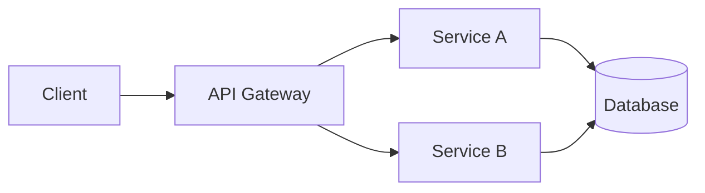

# ADR-[NUMBER]: [Descriptive Decision Title]

<!--
================================================================================
USAGE INSTRUCTIONS
================================================================================
1. Copy this template to a new file: NNNN-descriptive-title.md
2. Replace [NUMBER] with the next sequential number (e.g., 0001, 0002)
3. Complete all sections following the guidance in brackets
4. Remove instructional comments after completion
5. Submit for review via Pull Request per governance process
6. Ensure all Decision Drivers are explicitly addressed in the Rationale
================================================================================
-->

<!--
================================================================================
WHEN NOT TO CREATE AN ADR
================================================================================
Do NOT create an ADR for trivial, low-impact, or easily reversible decisions.
Examples of decisions that do NOT require an ADR:
- Routine dependency updates or patch versions
- Minor refactors with no architectural impact
- Small configuration changes
- Bug fixes or cosmetic improvements
- Decisions that can be reversed in under a day with minimal effort

ADRs must be reserved for decisions with long-term architectural implications,
significant trade-offs, or cross-team impact.

Rule of Thumb: If you need to ask "should this be an ADR?", consider whether
someone in 6 months will need to understand WHY this choice was made.
================================================================================
-->

<!--
================================================================================
ADR QUALITY GATES (Must pass before acceptance)
================================================================================
□ Problem statement is specific, measurable, and context-independent
□ At least Option 0 (Do Nothing) + 2 alternatives are evaluated
□ Each option has quantified effort, risk, and Driver Alignment
□ Rationale explicitly maps to each Decision Driver
□ Trade-offs are transparent with clear justification
□ Success criteria are measurable with baselines defined
□ All references are persistent (no ephemeral links)
□ Rollback plan is actionable with trigger criteria
================================================================================
-->

---

## Metadata

| Field               | Value                                                                  |
|---------------------|------------------------------------------------------------------------|
| **ADR Number**      | [NNNN]                                                                 |
| **Status**          | [Proposed \| Accepted \| Superseded \| Discontinued \| Rejected]       |
| **Decision Scope**  | [Team \| Cross-Team \| Organization-wide]                              |
| **Created**         | [YYYY-MM-DD]                                                           |
| **Last Updated**    | [YYYY-MM-DD]                                                           |
| **Decision Date**   | [YYYY-MM-DD or "Pending"]                                              |
| **Review Due**      | [YYYY-MM-DD — typically 12–18 months from acceptance]                  |
| **Supersedes**      | [Link to previous ADR, if applicable, or "N/A"]                        |
| **Superseded By**   | [Link to successor ADR, if applicable, or "N/A"]                       |

> **⚠️ Immutable Record**: This ADR is an immutable historical record. If the decision changes in the future, a new ADR must be created, referencing this document as **Superseded**. Do not edit accepted ADRs.

---

## Stakeholders

| Role                  | Name / Team                                                         |
|-----------------------|---------------------------------------------------------------------|
| **Decision Owner**    | [Name of the individual accountable for the decision]               |
| **Decision Maker(s)** | [Name(s) of individual(s) with final approval authority]            |
| **Contributors**      | [Names or teams that contributed to the analysis and elaboration]   |
| **Reviewers**         | [Names or teams responsible for technical review and validation]    |
| **Affected Parties**  | [Teams or systems impacted by this decision]                        |

---

## Context

### Business Context

[Describe the business scenario that motivated this decision. Include:

- Related strategic or operational objectives
- Stakeholder requirements and expectations
- Applicable regulatory, contractual, or compliance constraints
- Expected impact on products, customers, or revenue
- Business assumptions made for this analysis
- Time constraints or deadlines driving urgency]

### Technical Context

[Describe the current technical scenario that underpins this decision. Include:

- Current state of the architecture or existing solution
- Technical limitations or identified technical debt
- Events or changes that triggered the need for a decision
- Technical dependencies and relevant integrations
- Technical assumptions made for this analysis
- Relevant non-functional requirements (performance, scalability, security)]

> **📐 Visual Artifacts**: Include architecture diagrams or system boundary sketches when applicable. Visual representations significantly improve comprehension and reduce ambiguity.

---

### Architectural Overview (Optional)

[Provide diagrams or reference architecture snapshots if the decision affects system boundaries, interactions, or critical flows. This section is optional but highly recommended for decisions involving:

- Changes to system boundaries or service decomposition
- New integration points or data flows
- Infrastructure topology changes
- Security boundary modifications]

<!-- Include diagrams using:
- Mermaid syntax (natively supported by GitHub)
- Links to architectural diagrams in external tools (Miro, Lucidchart, draw.io)
- Embedded images stored in a docs/images/ directory

Example Mermaid diagram:

-->

---

## Problem Statement

[Define clearly and objectively the problem or challenge this decision intends to solve. Be specific and measurable whenever possible. The problem must be understandable by any technical member of the organization, regardless of project context.]

### Impact if Not Addressed

[Describe the consequences of inaction. What happens if this problem is not solved? Quantify where possible:

- Cost implications (engineering hours, infrastructure, revenue)
- Risk exposure (security, compliance, operational)
- Technical debt accumulation rate
- Impact on dependent teams or systems]

---

## Decision Drivers

[List the main factors that influence and drive this decision. Prioritize according to relevance to the organization. The final decision must be clearly linked to these drivers in the Rationale section.]

| #   | Driver                | Description                                           | Weight   | Non-Negotiable? |
|-----|-----------------------|-------------------------------------------------------|----------|-----------------|
| D1  | [Driver Name]         | [Description of the factor and its importance]        | High     | [Yes \| No]     |
| D2  | [Driver Name]         | [Description of the factor and its importance]        | High     | [Yes \| No]     |
| D3  | [Driver Name]         | [Description of the factor and its importance]        | Medium   | [Yes \| No]     |
| D4  | [Driver Name]         | [Description of the factor and its importance]        | Medium   | [Yes \| No]     |
| DN  | [Driver Name]         | [Description of the factor and its importance]        | Low      | [Yes \| No]     |

<!--
Common Decision Driver examples:
- Scalability and performance requirements
- Total Cost of Ownership (TCO)
- Time-to-market constraints
- Regulatory compliance (GDPR, SOX, PCI-DSS, HIPAA)
- Developer experience (DX) and productivity
- Skill availability within the team
- Integration complexity with existing systems
- Security and data privacy requirements
- Resilience, availability, and disaster recovery
- Observability and operational burden
- Vendor lock-in risk
- Long-term maintainability
-->

---

## Options Considered

> **Important**: Every ADR must evaluate the baseline scenario (Option 0: Do Nothing) before considering alternatives. This ensures that the cost and risk of change are explicitly compared against maintaining the status quo. A minimum of three options (including Option 0) should be evaluated for non-trivial decisions.

### Option 0: Do Nothing (Status Quo)

[Describe what happens if no action is taken. Explain the current state and the implications of maintaining it. This option serves as the baseline for comparison and ensures that change is justified.]

| Pros                                        | Cons                                            |
|---------------------------------------------|-------------------------------------------------|
| No implementation effort required           | [Current pain point 1 persists]                 |
| No change management or training needed     | [Current pain point 2 persists]                 |
| No risk of introducing new issues           | [Technical debt or limitation continues]        |
| No opportunity cost on other initiatives    | [Problem compounds over time]                   |

| Aspect               | Assessment                                                   |
|----------------------|--------------------------------------------------------------|
| **Estimated Effort** | None                                                         |
| **Technical Risk**   | Low (no change) / High (if problem worsens)                  |
| **Driver Alignment** | [Score: X/N drivers addressed] — [Summary of gaps]           |

---

### Option 1: [Option Name]

[Detailed description of the option, including:
- Technical approach and architecture
- Technologies, frameworks, or vendors involved
- Implementation model (build vs. buy, phased vs. big-bang)
- Key assumptions and constraints]

| Pros                | Cons                  |
|---------------------|-----------------------|
| [Advantage 1]       | [Disadvantage 1]      |
| [Advantage 2]       | [Disadvantage 2]      |
| [Advantage N]       | [Disadvantage N]      |

| Aspect               | Assessment                                                   |
|----------------------|--------------------------------------------------------------|
| **Estimated Effort** | [1–2 weeks \| 1 month \| 3 months \| >3 months]              |
| **Technical Risk**   | [Low \| Medium \| High \| Critical] — [Brief justification]  |
| **Driver Alignment** | [Score: X/N drivers addressed] — [D1 ✓, D2 ✓, D3 ✗, ...]     |

---

### Option 2: [Option Name]

[Detailed description of the option, including:
- Technical approach and architecture
- Technologies, frameworks, or vendors involved
- Implementation model (build vs. buy, phased vs. big-bang)
- Key assumptions and constraints]

| Pros                | Cons                  |
|---------------------|-----------------------|
| [Advantage 1]       | [Disadvantage 1]      |
| [Advantage 2]       | [Disadvantage 2]      |
| [Advantage N]       | [Disadvantage N]      |

| Aspect               | Assessment                                                   |
|----------------------|--------------------------------------------------------------|
| **Estimated Effort** | [1–2 weeks \| 1 month \| 3 months \| >3 months]              |
| **Technical Risk**   | [Low \| Medium \| High \| Critical] — [Brief justification]  |
| **Driver Alignment** | [Score: X/N drivers addressed] — [D1 ✓, D2 ✓, D3 ✗, ...]     |

---

### Option 3: [Option Name]

[Detailed description of the option, including:
- Technical approach and architecture
- Technologies, frameworks, or vendors involved
- Implementation model (build vs. buy, phased vs. big-bang)
- Key assumptions and constraints]

| Pros                | Cons                  |
|---------------------|-----------------------|
| [Advantage 1]       | [Disadvantage 1]      |
| [Advantage 2]       | [Disadvantage 2]      |
| [Advantage N]       | [Disadvantage N]      |

| Aspect               | Assessment                                                   |
|----------------------|--------------------------------------------------------------|
| **Estimated Effort** | [1–2 weeks \| 1 month \| 3 months \| >3 months]              |
| **Technical Risk**   | [Low \| Medium \| High \| Critical] — [Brief justification]  |
| **Driver Alignment** | [Score: X/N drivers addressed] — [D1 ✓, D2 ✓, D3 ✗, ...]     |

<!-- Add more options as needed, following the same format -->

---

### Options Comparison Matrix

| Criteria              | Option 0 | Option 1 | Option 2 | Option 3 |
|-----------------------|----------|----------|----------|----------|
| **Effort**            | None     | [Est.]   | [Est.]   | [Est.]   |
| **Technical Risk**    | [L/M/H]  | [L/M/H]  | [L/M/H]  | [L/M/H]  |
| **Driver Alignment**  | [X/N]    | [X/N]    | [X/N]    | [X/N]    |
| **Time to Value**     | N/A      | [Est.]   | [Est.]   | [Est.]   |
| **Long-term TCO**     | [Est.]   | [Est.]   | [Est.]   | [Est.]   |

---

## Decision

**Selected Option**: [Option N] — [Name of the Chosen Option]

### Rationale

[Justify the selection of the chosen option, explicitly linking to the identified Decision Drivers. Explain why this option was considered superior to the alternatives. Be objective and base the argument on technical and business criteria. Address why rejected options were not selected.]

| Driver | How the Decision Addresses It                                        | Fully Met? |
|--------|----------------------------------------------------------------------|------------|
| D1     | [Explanation of how the chosen option satisfies this driver]         | ✓ / ◐ / ✗  |
| D2     | [Explanation of how the chosen option satisfies this driver]         | ✓ / ◐ / ✗  |
| D3     | [Explanation of how the chosen option satisfies this driver]         | ✓ / ◐ / ✗  |
| DN     | [Explanation of how the chosen option satisfies this driver]         | ✓ / ◐ / ✗  |

> **Legend**: ✓ = Fully addressed | ◐ = Partially addressed | ✗ = Not addressed (accepted gap)

### Why Not Other Options?

| Option Rejected | Primary Reason for Rejection                                         |
|-----------------|----------------------------------------------------------------------|
| Option 0        | [Reason — e.g., "Problem severity justifies change effort"]          |
| Option 1        | [Reason — e.g., "Higher risk profile with similar benefits"]         |
| Option 3        | [Reason — e.g., "Cost exceeds budget constraints"]                   |

---

## Consequences

### Positive Consequences

- [Expected benefit 1 from implementing this decision]
- [Expected benefit 2 from implementing this decision]
- [Expected benefit N from implementing this decision]

### Negative Consequences

- [Accepted negative impact 1 as part of this decision]
- [Accepted negative impact 2 as part of this decision]
- [Accepted negative impact N as part of this decision]

### Identified Risks

| ID   | Risk Description          | Probability | Impact | Severity | Mitigation Strategy                        | Owner       |
|------|---------------------------|-------------|--------|----------|--------------------------------------------|-------------|
| R1   | [Risk description 1]      | [L/M/H]     | [L/M/H]| [P×I]    | [Mitigation strategy]                      | [Name/Team] |
| R2   | [Risk description 2]      | [L/M/H]     | [L/M/H]| [P×I]    | [Mitigation strategy]                      | [Name/Team] |
| RN   | [Risk description N]      | [L/M/H]     | [L/M/H]| [P×I]    | [Mitigation strategy]                      | [Name/Team] |

### Long-term Implications

- **Positive**: [Long-term benefit that compounds over time]
- **Negative**: [Long-term cost or constraint this decision introduces]
- **Neutral**: [Structural change that is neither positive nor negative but notable]

---

## Impacts

### Technical Impacts

| Area               | Impact Description                                                        | Severity |
|--------------------|---------------------------------------------------------------------------|----------|
| **Architecture**   | [Describe changes to system architecture, components, or integrations]    | [H/M/L]  |
| **Infrastructure** | [Describe changes to servers, cloud, networks, or environments]           | [H/M/L]  |
| **Code**           | [Describe changes to codebases, libraries, or dependencies]               | [H/M/L]  |
| **Data**           | [Describe changes to data models, databases, or data flows]               | [H/M/L]  |
| **Security**       | [Describe security implications, authentication, or authorization]        | [H/M/L]  |
| **Observability**  | [Describe changes to logging, monitoring, or alerting]                    | [H/M/L]  |
| **Performance**    | [Describe expected performance impact — latency, throughput, resource]    | [H/M/L]  |

### Organizational Impacts

| Area                  | Impact Description                                                              |
|-----------------------|---------------------------------------------------------------------------------|
| **Affected Teams**    | [List teams or areas impacted by this decision]                                 |
| **Training**          | [Describe training needs or new skill development requirements]                 |
| **Processes**         | [Describe changes to processes, workflows, or ceremonies]                       |
| **Documentation**     | [Describe needs for updating technical or business documentation]               |
| **Communication**     | [Describe the communication plan for stakeholders]                              |
| **Change Management** | [Describe alignment, rollout activities, and adoption tracking across teams]    |

---

## Trade-offs

[Explicitly list the trade-offs the organization is accepting by adopting this decision. Be transparent about what is being sacrificed in favor of other benefits. Trade-offs should be conscious, documented choices — not oversights.]

| What We Are Prioritizing | What We Are Giving Up        | Justification                                             |
|--------------------------|------------------------------|-----------------------------------------------------------|
| [Priority 1]             | [Sacrifice 1]                | [Why this trade-off is acceptable given the context]      |
| [Priority 2]             | [Sacrifice 2]                | [Why this trade-off is acceptable given the context]      |
| [Priority N]             | [Sacrifice N]                | [Why this trade-off is acceptable given the context]      |

<!--
Example trade-off row:
| Time-to-market           | Long-term maintainability    | Business deadline requires faster delivery; we accept accruing technical debt to be addressed in Q2 with dedicated sprint |
-->

---

## Implementation Plan

### Implementation Phases

| Phase | Description                          | Owner         | Duration      | Deliverables                    | Exit Criteria                  |
|-------|--------------------------------------|---------------|---------------|---------------------------------|--------------------------------|
| 1     | [Description of phase 1 activities]  | [Team/Person] | [Duration]    | [Artifacts delivered]           | [Definition of done]           |
| 2     | [Description of phase 2 activities]  | [Team/Person] | [Duration]    | [Artifacts delivered]           | [Definition of done]           |
| N     | [Description of phase N activities]  | [Team/Person] | [Duration]    | [Artifacts delivered]           | [Definition of done]           |

### Dependencies

| ID   | Dependency              | Description                        | Status      | Owner       | Due Date   |
|------|-------------------------|------------------------------------|-------------|-------------|------------|
| DEP1 | [Dependency 1]          | [Description]                      | [Status]    | [Owner]     | [Date]     |
| DEP2 | [Dependency 2]          | [Description]                      | [Status]    | [Owner]     | [Date]     |
| DEPN | [Dependency N]          | [Description]                      | [Status]    | [Owner]     | [Date]     |

### Rollback Plan

[Describe the rollback plan in case the implementation encounters critical issues. A well-defined rollback plan is mandatory for high-impact decisions.]

**Rollback Trigger Criteria**:

- [Quantitative criterion 1 — e.g., "Error rate exceeds 5% for 15 minutes"]
- [Quantitative criterion 2 — e.g., "Latency p99 degrades by >200ms"]
- [Qualitative criterion — e.g., "Critical security vulnerability discovered"]

**Execution Steps**:

1. [Rollback step 1 — specific and actionable]
2. [Rollback step 2 — specific and actionable]
3. [Rollback step N — specific and actionable]

**Rollback Validation**:

- [How to verify rollback was successful]

**Estimated Rollback Time**: [Duration — e.g., "< 30 minutes"]

**Rollback Owner**: [Name/Team responsible for executing rollback]

---

## Success Criteria

[Define objective and measurable metrics that will indicate whether the decision was successful after implementation. Success criteria should be SMART: Specific, Measurable, Achievable, Relevant, Time-bound.]

| ID   | Criterion         | Metric                     | Baseline      | Target        | Evaluation Date |
|------|-------------------|----------------------------|---------------|---------------|-----------------|
| SC1  | [Criterion 1]     | [How it will be measured]  | [Current]     | [Target]      | [Date]          |
| SC2  | [Criterion 2]     | [How it will be measured]  | [Current]     | [Target]      | [Date]          |
| SCN  | [Criterion N]     | [How it will be measured]  | [Current]     | [Target]      | [Date]          |

### Success Evaluation Plan

- **Evaluation Owner**: [Name/Team]
- **Evaluation Method**: [How metrics will be collected and analyzed]
- **Reporting Cadence**: [How often progress will be reported until target date]
- **Failure Response**: [What happens if targets are not met]

---

## References

[List all sources, documents, articles, RFCs, or other ADRs that support or complement this decision. All references must be persistent — avoid ephemeral links like Slack messages or transient wiki pages.]

- [Reference Title 1](URL or document path) — [Brief description of relevance]
- [Reference Title 2](URL or document path) — [Brief description of relevance]
- [Reference Title N](URL or document path) — [Brief description of relevance]

### Related ADRs

| ADR          | Title                | Relationship                              |
|--------------|----------------------|-------------------------------------------|
| [ADR-XXXX](link) | [ADR Title]      | [Supersedes \| Complements \| Depends On] |
| [ADR-YYYY](link) | [ADR Title]      | [Supersedes \| Complements \| Depends On] |

---

## Revision History

| Version | Date       | Author  | Change Description                                    |
|---------|------------|---------|-------------------------------------------------------|
| 1.0     | [Date]     | [Name]  | Initial version                                       |
| 1.1     | [Date]     | [Name]  | [Change description — e.g., "Incorporated PR feedback"] |

---

## Validation Checklist

<!--
This checklist must be completed before submitting for review.
Remove this section after final validation and acceptance.
-->

### Content Completeness

- [ ] Problem statement is specific, measurable, and understandable without project context
- [ ] Business and technical context are clearly separated and complete
- [ ] Decision Drivers are prioritized with weights and non-negotiable flags defined
- [ ] Impact if Not Addressed quantifies consequences of inaction

### Options Analysis

- [ ] Option 0 (Do Nothing) is evaluated as baseline
- [ ] At least 2 additional options are evaluated with consistent structure
- [ ] Each option has Effort, Risk, and Driver Alignment assessments
- [ ] Options Comparison Matrix provides side-by-side view
- [ ] Rejected options have documented rationale

### Decision Quality

- [ ] Rationale explicitly maps to each Decision Driver with coverage indicator
- [ ] Trade-offs are explicit, justified, and conscious choices
- [ ] Risks have owners and mitigation strategies assigned
- [ ] Long-term implications (positive, negative, neutral) are documented

### Implementation Readiness

- [ ] Implementation phases have owners, durations, and exit criteria
- [ ] Dependencies are identified with owners and due dates
- [ ] Rollback plan has quantitative trigger criteria and validation steps
- [ ] Success criteria are SMART with baselines and target dates

### Governance Compliance

- [ ] All stakeholders are identified with roles
- [ ] References are persistent (no ephemeral links)
- [ ] Document reviewed by at least one technical peer
- [ ] ADR number assigned by ADR Steward
