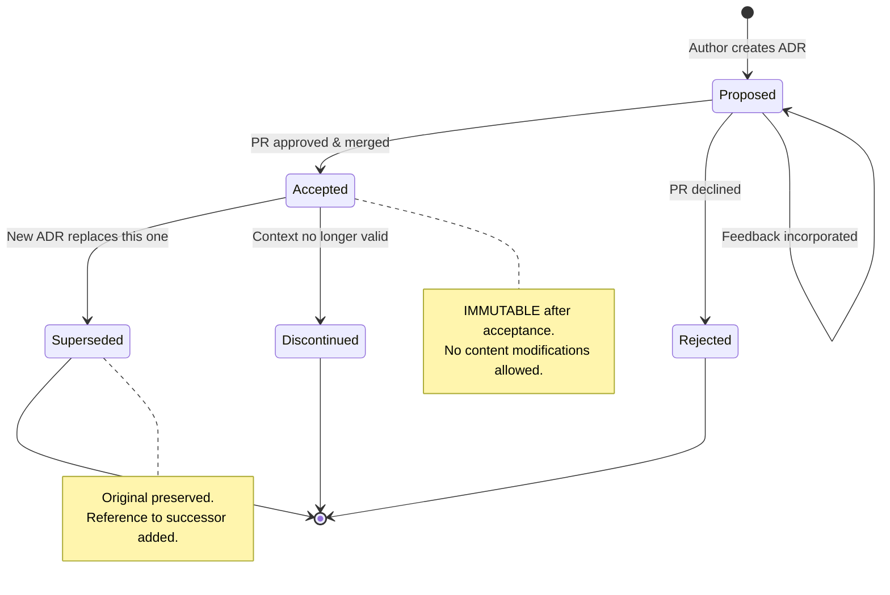
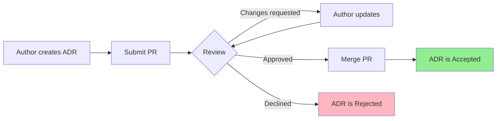
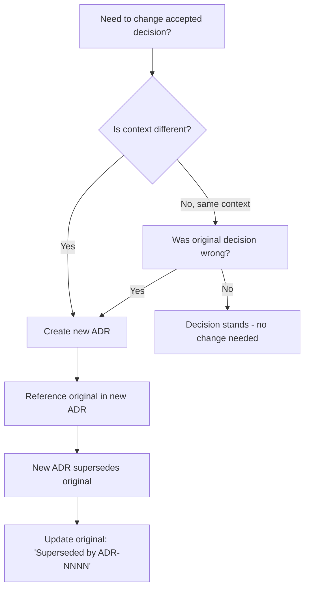

# Architecture Decision Records (ADR) Repository

> **Canonical Documentation**: This README serves as the authoritative operational guide for the ADR repository.
> For template usage, see [`0000-template.md`](0000-template.md).
> For the foundational ADR adoption decision, see [`0001-adopt-adrs.md`](0001-adopt-adrs.md).

---

## Executive Summary

This directory contains the organization's **Architecture Decision Records (ADRs)**—immutable documents that capture significant architectural and technical decisions, their context, rationale, and consequences.

**Purpose**: Preserve institutional knowledge, enable informed future decisions, and maintain architectural governance.

**Authority**: All ADRs in this repository follow the Michael Nygard format with enterprise extensions, as established in [ADR-0001](0001-adopt-adrs.md).

---

## Quick Start (TL;DR)

```bash
# 1. Find the next available ADR number
ls docs/adr/*.md | sort | tail -1

# 2. Copy the template
cp docs/adr/0000-template.md docs/adr/NNNN-your-decision-slug.md

# 3. Edit required sections (Metadata, Context, Decision, Consequences)
# 4. Submit PR for review
# 5. Upon approval and merge, ADR becomes Accepted and IMMUTABLE
```

**Minimum Viable ADR**: Metadata + Context + Decision + Consequences

---

## Table of Contents

1. [ADR Index](#adr-index)
2. [Repository Scope](#repository-scope)
3. [When to Create an ADR](#when-to-create-an-adr)
4. [When NOT to Create an ADR](#when-not-to-create-an-adr)
5. [ADR Lifecycle](#adr-lifecycle)
6. [Status Definitions](#status-definitions)
7. [Governance & Ownership](#governance--ownership)
8. [Quality Standards](#quality-standards)
9. [File Naming Convention](#file-naming-convention)
10. [Directory Structure](#directory-structure)
11. [Review Process](#review-process)
12. [Immutability Principle](#immutability-principle)
13. [Tools & Automation](#tools--automation)
14. [FAQ](#faq)
15. [References](#references)

---

## ADR Index

### Active ADRs

| ID | Title | Status | Date | Author |
|----|-------|--------|------|--------|
| [ADR-0000](0000-template.md) | ADR Template | Template | — | Architecture Team |
| [ADR-0001](0001-adopt-adrs.md) | Adopt Architecture Decision Records | `Accepted` | 2025-01-15 | Architecture Team |

### By Status

| Status | Count | ADRs |
|--------|-------|------|
| Proposed | 0 | — |
| Accepted | 1 | ADR-0001 |
| Superseded | 0 | — |
| Discontinued | 0 | — |
| Rejected | 0 | — |

### By Tag

| Tag | ADRs |
|-----|------|
| `governance` | ADR-0001 |
| `meta-adr` | ADR-0001 |
| `foundational` | ADR-0001 |

---

## Repository Scope

### What Belongs Here

This ADR repository documents **organization-wide** architectural decisions that:

- Affect multiple systems or teams
- Establish patterns or standards
- Have long-term implications (> 6 months)
- Require cross-functional alignment

### Repository vs. Project ADRs

| Scope | Location | Examples |
|-------|----------|----------|
| **Organization-wide** | This repository (`tech-architecture-adr`) | Technology standards, governance processes, cross-cutting concerns |
| **Project-specific** | `docs/adr/` in project repository | Project-specific technology choices, local architecture patterns |

**Rule**: If a decision affects only one project/service, document it in that project's repository.

---

## When to Create an ADR

### ADR Required ✅

| Category | Examples |
|----------|----------|
| **Technology Adoption** | New programming language, framework, database, or cloud service |
| **Architectural Patterns** | Microservices vs. monolith, event sourcing, CQRS |
| **API Strategy** | REST vs. GraphQL, versioning strategy, breaking changes |
| **Security Architecture** | Authentication mechanism, encryption standards, zero-trust implementation |
| **Data Architecture** | Data modeling approach, partitioning strategy, retention policies |
| **Infrastructure Decisions** | Kubernetes adoption, multi-region deployment, CDN selection |
| **Integration Patterns** | Message queue selection, API gateway, service mesh |
| **Deprecation/Migration** | Sunsetting a technology, major version migration |

### ADR Recommended ⚠️

| Category | Examples |
|----------|----------|
| **Development Standards** | Code style enforcement, testing strategy, branching model |
| **Tooling Decisions** | CI/CD platform, monitoring stack, IDE recommendations |
| **Process Changes** | Code review requirements, release process modifications |

---

## When NOT to Create an ADR

### ADR Not Required ❌

| Category | Examples | Why Not |
|----------|----------|---------|
| **Bug Fixes** | Fixing null pointer exceptions | Tactical, not architectural |
| **Minor Refactoring** | Renaming variables, extracting methods | No architectural impact |
| **Dependency Updates** | Bumping patch/minor versions | Routine maintenance |
| **Configuration Changes** | Environment variables, feature flags | Operational, not architectural |
| **Reversible Decisions** | A/B test configurations | Easily changed without impact |
| **Implementation Details** | Algorithm selection within a function | Below architectural threshold |

### Gray Areas (Use Judgment)

| Scenario | Guidance |
|----------|----------|
| Major library upgrade (e.g., React 17→18) | ADR if API changes or migration complexity is significant |
| Adding a new microservice | ADR if it establishes a pattern; skip if following existing pattern |
| Changing build tools | ADR if affects developer workflow organization-wide |

**Heuristic**: If you'll need to explain the "why" to someone in 6 months, create an ADR.

---

## ADR Lifecycle



### State Transitions

| From | To | Trigger | Action Required |
|------|----|---------|-----------------|
| — | Proposed | Author creates PR | Fill template, submit PR |
| Proposed | Proposed | Reviewer requests changes | Author updates, re-requests review |
| Proposed | Accepted | PR approved and merged | Status field updated to `Accepted` |
| Proposed | Rejected | PR declined | Status field updated to `Rejected`; rationale added |
| Accepted | Superseded | New ADR created | Add "Superseded by: ADR-NNNN" to original |
| Accepted | Discontinued | Context invalidated | Add discontinuation note with explanation |

---

## Status Definitions

| Status | Symbol | Meaning | Mutability |
|--------|--------|---------|------------|
| **Proposed** | 🟡 | Under review; open for feedback and revision | Mutable |
| **Accepted** | 🟢 | Approved; decision is in effect | **Immutable** |
| **Superseded** | 🔵 | Replaced by a newer ADR | Immutable (add successor reference only) |
| **Discontinued** | ⚫ | No longer applicable; context has changed | Immutable (add discontinuation note only) |
| **Rejected** | 🔴 | Reviewed and declined; decision not adopted | Immutable |

### Status Field Format

```markdown
| **Status** | `Accepted` |
```

Use backticks around status value for visual consistency.

---

## Governance & Ownership

### Roles and Responsibilities

| Role | Responsibilities | Who |
|------|------------------|-----|
| **ADR Author** | Creates ADR, addresses review feedback, shepherds to acceptance | Any engineer |
| **ADR Reviewer** | Validates technical accuracy, completeness, and governance compliance | Peer engineers, tech leads |
| **ADR Approver** | Final approval authority; ensures architectural alignment | Architecture owner, principal engineer |
| **Governance Owner** | Maintains template, process, and repository health | Architecture Governance Team |

### Review Requirements

| ADR Type | Minimum Reviewers | Approver |
|----------|-------------------|----------|
| Organization-wide | 2 | Architecture owner or CTO delegate |
| Project-specific | 1 | Tech lead or project architect |
| Meta-ADR (process changes) | 2 | Architecture Governance Team |

### Service Level Agreements (SLAs)

| Stage | Target Duration | Escalation Path |
|-------|-----------------|-----------------|
| Initial review | 48 hours | Ping in Slack after 48h |
| Feedback incorporation | 72 hours | Re-request review |
| Final approval | 24 hours after last change | Escalate to governance owner |

**Total Target**: Proposed → Accepted in < 1 week for standard ADRs.

---

## Quality Standards

### Minimum Requirements (Must Pass)

Every ADR must include:

| Section | Requirement |
|---------|-------------|
| **Metadata** | ADR ID, Title, Status, Date, Author |
| **Context** | Clear explanation of situation prompting decision |
| **Decision** | Explicit statement of what was decided |
| **Consequences** | At least one positive and one negative consequence |

### Quality Checklist

Use this checklist before submitting an ADR for review:

- [ ] **Metadata complete**: All required fields filled
- [ ] **Context is sufficient**: A new team member could understand the situation
- [ ] **Problem is clear**: The "why" is explicit, not just the "what"
- [ ] **Options documented**: At least 2 options considered (including status quo)
- [ ] **Decision is explicit**: Clear, unambiguous statement of choice
- [ ] **Rationale explains "why"**: Not just restating the decision
- [ ] **Consequences are balanced**: Both positive and negative listed
- [ ] **No implementation details**: ADR describes "what" not "how to implement"
- [ ] **Cross-references added**: Links to related ADRs, tickets, or documentation
- [ ] **Spell-checked and formatted**: Professional quality

### Anti-Patterns to Avoid

| Anti-Pattern | Problem | Fix |
|--------------|---------|-----|
| **Vague Context** | "We need to improve performance" | Specify metrics, constraints, stakeholders |
| **Missing Alternatives** | Only one option presented | Always include Option 0 (status quo) |
| **Rationale-Free Decision** | "We chose X" without explaining why | Connect decision to drivers and context |
| **Implementation Masquerading as ADR** | Step-by-step implementation guide | Move implementation details to separate doc |
| **Premature ADR** | Decision not yet stable | Wait until decision solidifies, or mark Proposed |
| **ADR-by-Committee** | 10 authors, no owner | Single accountable author; others as reviewers |

---

## File Naming Convention

### Format

```
NNNN-descriptive-slug.md
```

### Rules

| Rule | Correct | Incorrect |
|------|---------|-----------|
| 4-digit zero-padded prefix | `0001-`, `0042-`, `0123-` | `1-`, `42-`, `123-` |
| Lowercase slug | `adopt-adrs` | `Adopt-ADRs`, `ADOPT_ADRS` |
| Hyphens as separators | `use-postgresql-database` | `use_postgresql_database` |
| No special characters | `api-versioning-strategy` | `api-v2.0-strategy` |
| Descriptive but concise | `adopt-kubernetes` | `decide-to-use-kubernetes-for-container-orchestration` |

### Reserved Numbers

| Number | Purpose |
|--------|---------|
| `0000` | Template (never used for actual decisions) |
| `0001` | Meta-ADR (ADR adoption decision) |
| `0002+` | Available for decisions |

### Number Assignment

Numbers are assigned **sequentially** and **never reused**, even if an ADR is rejected or superseded.

```bash
# Find next available number
ls docs/adr/*.md | grep -E '^[0-9]{4}' | sort | tail -1
# If last is 0005-xyz.md, next is 0006-your-slug.md
```

---

## Directory Structure

```
docs/adr/
├── README.md              # This file (index and guide)
├── 0000-template.md       # Canonical ADR template
├── 0001-adopt-adrs.md     # Meta-ADR: ADR adoption decision
├── 0002-*.md              # First actual decision
├── 0003-*.md              # Second decision
├── ...
└── superseded/            # Optional: archive for superseded ADRs
    └── 0002-*.md          # Moved here when superseded (optional workflow)
```

### Superseded ADR Handling

Two valid approaches:

| Approach | Workflow | Pros | Cons |
|----------|----------|------|------|
| **In-place** | Keep superseded ADRs in main directory | Simple; preserves Git history | Directory may grow large |
| **Archive** | Move to `superseded/` subdirectory | Cleaner main directory | Requires file move; URL changes |

**Recommendation**: Start with in-place; consider archive if ADR count exceeds 50.

---

## Review Process

### Workflow Diagram



### PR Template Integration

Consider adding ADR-specific PR template (`.github/PULL_REQUEST_TEMPLATE/adr.md`):

```markdown
## ADR Submission Checklist

- [ ] ADR follows naming convention (NNNN-slug.md)
- [ ] All required sections completed
- [ ] At least 2 options considered
- [ ] Consequences include positive and negative
- [ ] Related ADRs cross-referenced
- [ ] No implementation details included

## Reviewers
- [ ] Technical accuracy validated
- [ ] Architectural alignment confirmed
- [ ] Governance compliance checked
```

---

## Immutability Principle

### The Golden Rule

> **Once an ADR is Accepted, its content is IMMUTABLE.**

This is the most critical governance principle. It ensures:

1. **Audit Trail Integrity**: Historical decisions remain unaltered
2. **Reference Stability**: Links to ADRs always show the original decision
3. **Accountability Preservation**: Decision authorship and rationale are permanent

### What Immutability Means

| Allowed After Acceptance | Not Allowed After Acceptance |
|--------------------------|------------------------------|
| Add "Superseded by: ADR-NNNN" | Change decision content |
| Add "Discontinued" status with date | Modify rationale |
| Fix typos in metadata (with PR) | Add/remove options |
| Add cross-reference links | Alter consequences |

### Changing a Decision



---

## Tools & Automation

### CI/CD Validation

This repository includes automated validation via GitHub Actions:

**Workflow**: `.github/workflows/adr-validation.yml`

**Validations performed**:
- ✅ Naming convention compliance (NNNN-slug.md)
- ✅ Required sections present (Metadata, Context, Decision, Consequences)
- ✅ Metadata field completeness
- ✅ Valid status values
- ✅ Immutability protection (prevents modification of Accepted ADRs)
- ✅ Supersession chain validation

### Optional Tools

| Tool | Purpose | Link |
|------|---------|------|
| **adr-tools** | CLI for creating/managing ADRs | [GitHub](https://github.com/npryce/adr-tools) |
| **Log4brains** | ADR management with web UI | [GitHub](https://github.com/thomvaill/log4brains) |
| **adr-viewer** | Static site generator for ADRs | [GitHub](https://github.com/mrwilson/adr-viewer) |

### IDE Integration

**VS Code Snippets**: Consider creating snippets for common ADR sections.

**Markdown Preview**: Use VS Code's built-in Markdown preview or extensions like "Markdown Preview Enhanced" for Mermaid diagram rendering.

---

## FAQ

### General Questions

**Q: How long should an ADR be?**
A: As long as necessary, but no longer. Simple decisions: 1-2 pages. Complex decisions: up to 5 pages. If exceeding 5 pages, consider splitting or linking to detailed appendices.

**Q: Who can create an ADR?**
A: Any engineer. ADRs are not limited to senior staff. However, significant decisions should involve appropriate reviewers.

**Q: Can I create an ADR for a decision already made?**
A: Yes! Retroactive ADRs capture important decisions that were made without documentation. Clearly note in the ADR that it documents a prior decision.

**Q: What if reviewers disagree on the decision?**
A: Escalate to the architecture owner or designated tie-breaker. Document dissenting opinions in the ADR if significant.

### Process Questions

**Q: How do I supersede an ADR?**
A: Create a new ADR that references the original in its "Supersedes" field. After the new ADR is accepted, add "Superseded by: ADR-NNNN" to the original's metadata.

**Q: Can a Rejected ADR be reconsidered?**
A: Yes, but create a new ADR. Do not modify the rejected one. Reference the rejected ADR and explain what changed to warrant reconsideration.

**Q: What happens to ADRs when a project is decommissioned?**
A: ADRs remain as historical record. Consider marking project-specific ADRs as "Discontinued" with a note about project decommissioning.

### Technical Questions

**Q: Should ADRs include code examples?**
A: Sparingly. Brief code snippets to illustrate a pattern are acceptable. Detailed implementation belongs in separate documentation.

**Q: How do I handle sensitive information in ADRs?**
A: ADRs should not contain secrets, credentials, or highly sensitive details. Reference security documentation by link if needed. Consult security team for guidance.

**Q: Can ADRs span multiple repositories?**
A: Organization-wide ADRs live in this central repository. Project-specific ADRs live in their respective repositories. Cross-reference using full URLs.

---

## References

### Foundational Reading

1. **Nygard, Michael** (2011). "Documenting Architecture Decisions."
   https://cognitect.com/blog/2011/11/15/documenting-architecture-decisions

2. **ThoughtWorks Technology Radar**. "Lightweight Architecture Decision Records."
   https://www.thoughtworks.com/radar/techniques/lightweight-architecture-decision-records

3. **Keeling, Michael** (2017). "Design It!: From Programmer to Software Architect." Pragmatic Bookshelf.
   - Chapter on decision documentation

### Template Resources

4. **MADR (Markdown Any Decision Records)**: https://adr.github.io/madr/
5. **ADR GitHub Organization**: https://adr.github.io/

### Tool Documentation

6. **adr-tools**: https://github.com/npryce/adr-tools
7. **Log4brains**: https://thomvaill.github.io/log4brains/

### Standards

8. **ISO/IEC/IEEE 42010:2011** — Systems and Software Engineering — Architecture Description
9. **TOGAF 9.2** — Architecture Decision Management

---

## Changelog

| Date | Author | Change |
|------|--------|--------|
| 2025-01-15 | Architecture Governance Team | Initial README creation |

---

*This document is maintained by the Architecture Governance Team. For questions, contact #architecture-governance on Slack.*
